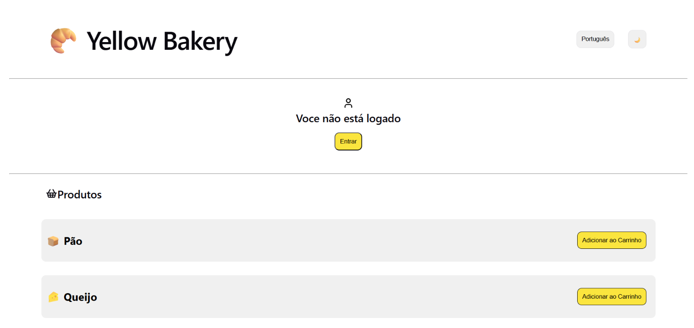

# Carrinho de compras

## Funcionalidades
- Carrinho de compras (adicionar e retirar produtos)
- Mudança de linguagem (pt/eng)
- Mudança de tema (dark/light)
- Login

## Criar projeto React
````npm create vite@latest [nome da pasta]````

## Rodar projeto
```npm run dev```

## Estilização
- Permite o uso de dois estilos
``<div className={`${styles.product} ${styles[theme]}`}>``

- Icones React
`` npm install lucide-react ``

## Deploy no Github Pages
1.No terminal do seu projeto, instale a biblioteca como dependência de desenvolvimento: ``npm install gh-pages --save-dev``

- Resultado no **package.json**: ``"gh-pages": "^6.3.0",``

2.No **packege.json** adiciona
``
"scripts": {
    "predeploy":"npm run build",
    "deploy": "gh-pages -d dist"
  },
``

3.No arquivo **package.json** adiciona a linha ``"homepage": "https://nome-de-usuario.github.io/nome-do-repositorio",`` logo abaixo de **name**.

4.Em **vit.config** adiciona
``
export default defineConfig({
  base: "/nome-do-repositorio",
})
``

5.Sobe configurações para o github

6.Utilliza ``npm run deploy`` para rodar o deploy

7.Em pages no GitHub direcionar a página para a branch ``gh-pages``

## Pré-Visualização
<kbd>

</kbd>

[](https://brunasilva701.github.io/Padaria-Yellow-React/)
